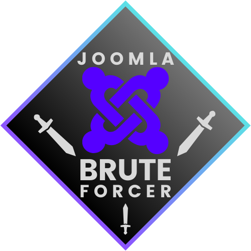
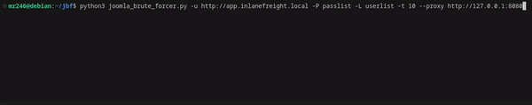

  
  <h2>JOOMLA BRUTE FORCER</h2>

<h4>
    <a href="https://github.com/emre-mr246/Joomla-Brute-Forcer/issues">❔ Ask a Question</a>
   · 
    <a href="https://github.com/emre-mr246/Joomla-Brute-Forcer/issues">🪲 Report Bug</a>
   · 
    <a href="https://github.com/emre-mr246/Joomla-Brute-Forcer/issues">💬 Request Feature</a>
</h4>

## Introduction 🚀

The "Joomla Brute Forcer" can perform a brute force attack on the Joomla admin panel using dynamically generated CSRF tokens and cookies, leveraging a high number of threads.

## Requirements 📚

To run this script, you need to have the following Python packages installed:

requests: For making HTTP requests.

beautifulsoup4: For parsing HTML and XML documents.

If these packages are not already installed on your system.

Run the following command in your terminal:

`pip install requests beautifulsoup4`

## Image 📸

## Arguments 📚

`-u/--url:` URL. Example: http://test.com
`-p:` Only one password
`-P:` Passwordlist
`-l:` Only one username
`-L:` Userlist
`--proxy:` Proxy. Example: http://127.0.0.1:8080
`-t/--thread:` Number of threads.

## Usage 🔍

1.  In the project's main directory, compile the library using the `make` command.
   `$ python3 joomla_brute_forcer.py -u http://test.com -P passwordlist -L userlist --proxy 127.0.0.1:8080 -t 10` 

